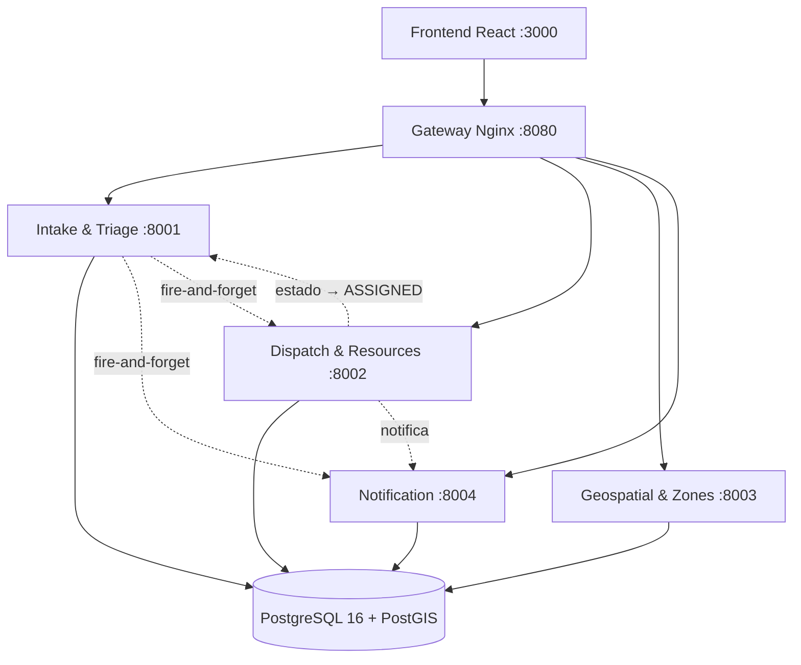

# Emergency Platform

Plataforma de gestión de emergencias con dos perfiles de usuario: el **ciudadano**
reporta una emergencia y el **operador** la ve, la despacha y le hace seguimiento
desde un dashboard con mapa.

La arquitectura son **cuatro microservicios independientes** detrás de un gateway,
sobre PostgreSQL + PostGIS. No hay backend monolítico ni paquete de dominio
compartido entre servicios.

La especificación completa está en [`emergency-platform-spec.md`](emergency-platform-spec.md)
y es la fuente de verdad del proyecto.

---

## Arquitectura



| Servicio | Responsabilidad | Esquema propio |
|---|---|---|
| **Intake & Triage** | Valida la emergencia, calcula prioridad (P1–P4), persiste, dispara notificación y auto-despacho | `intake` |
| **Dispatch & Resource Assignment** | Busca recursos disponibles y cercanos, asigna, actualiza el despacho | `dispatch` |
| **Geospatial & Zone Aggregation** | Consultas por zona y cálculo de hotspots con PostGIS | `geo` |
| **Notification & Status Broadcast** | Registra y difunde los cambios de estado | `notification` |

El frontend habla **solo** con el gateway (`http://localhost:8080`), nunca con los
puertos de los servicios. Así, migrar a API Gateway en AWS es cambiar una variable
de entorno.

---

## Estado de construcción

El proyecto se construye por fases. Estado actual:

- [x] **Fase 1 — Base:** repo, Docker Compose, Postgres + PostGIS, migraciones, seeds, Makefile
- [x] **Fase 2 — Intake:** triage con tests, schemas, rutas
- [x] **Fase 3 — Dispatch:** `nearby` con PostGIS, asignación con bloqueo, auto-despacho
- [x] **Fase 4 — Geospatial + Notification:** hotspots con clustering, SSE
- [x] **Fase 5 — Gateway + Frontend:** Nginx, formulario ciudadano, dashboard operador
- [ ] **Fase 6 — Supabase:** RLS y Realtime

---

## Requisitos

- Docker y Docker Compose v2 (`docker compose version`)
- `make`

Nada más: no hace falta Python ni Node en la máquina para levantar la plataforma.

---

## Cómo levantar

```bash
cp .env.example .env
make up
```

Guía paso a paso, recorrido de demostración y resolución de problemas en
[`docs/ejecucion-local.md`](docs/ejecucion-local.md).

`make up` construye las imágenes, levanta Postgres, espera a que esté sano, aplica
las migraciones y carga los seeds. Cuando termina, la base tiene 20 recursos y 21
emergencias de demostración.

Verificación rápida:

```bash
make psql
```
```sql
SELECT city, count(*) FROM dispatch.resources GROUP BY city;
SELECT city, priority, status FROM intake.emergencies ORDER BY created_at DESC LIMIT 5;
```

### Comandos

| Comando | Qué hace |
|---|---|
| `make up` | Levanta todo (migraciones y seeds incluidos) |
| `make down` | Detiene los contenedores, conserva los datos |
| `make logs` | Sigue los logs |
| `make ps` | Estado de los contenedores |
| `make migrate` | Reaplica solo las migraciones |
| `make seed` | Recarga los seeds |
| `make psql` | Abre una sesión psql contra la base local |
| `make test` | Corre los tests de todos los servicios |
| `make reset` | Borra el volumen de Postgres y recrea todo desde cero |

---

## Base de datos

Un **esquema por microservicio** para mantener la autonomía: ningún servicio
escribe en el esquema de otro. La única lectura cruzada permitida es la de
`geospatial` sobre `intake.emergencies`, concedida con el rol de solo lectura
`geo_reader` y documentada en [`docs/decisiones.md`](docs/decisiones.md).

```
auth          └── users              (Supabase Auth; en local se simula)
intake        └── emergencies
dispatch      ├── resources
              └── assignments
geo           └── hotspots
notification  └── notifications
```

Las migraciones viven en `database/migrations/`, numeradas y **idempotentes**
(`IF NOT EXISTS`, bloques `DO $$ … $$`), porque el mismo SQL se ejecuta después en
Supabase sin modificaciones. Se pueden volver a correr cuantas veces haga falta.

| Archivo | Contenido |
|---|---|
| `001_extensions.sql` | PostGIS, pgcrypto |
| `002_schemas.sql` | Esquemas + `auth.users` simulada |
| `003_enums.sql` | Los 10 tipos enumerados |
| `004_tables.sql` | Tablas |
| `005_indexes.sql` | Índices GIST y de consulta |
| `006_triggers.sql` | `sync_location()` y `set_updated_at()` |
| `007_grants.sql` | Rol `geo_reader` |

Dos reglas que conviene tener presentes al escribir código contra estas tablas:

- **`location` nunca se escribe desde la aplicación.** Se deriva siempre de
  `latitude`/`longitude` en un trigger `BEFORE INSERT OR UPDATE`, así que no pueden
  quedar desincronizados.
- **`updated_at`** lo mantiene otro trigger en `emergencies` y `resources`.

Los seeds (`database/seeds/`) cargan 5 recursos por ciudad —uno de cada tipo— y 21
emergencias, de las cuales 9 están concentradas en un radio de ~800 m en Cali para
que el cálculo de hotspots dé un resultado visible en la demo. Una de esas 9 está
`CANCELLED` a propósito: los hotspots solo cuentan emergencias activas, así que el
cluster debe dar **8**.

---

## Variables de entorno

Todas viven en `.env` (git-ignored). `.env.example` tiene los valores de local y
placeholders para Supabase.

| Variable | Para qué |
|---|---|
| `POSTGRES_USER` / `POSTGRES_PASSWORD` / `POSTGRES_DB` / `POSTGRES_PORT` | Postgres local |
| `DATABASE_URL` | Conexión de los servicios. **Única variable que cambia entre local y Supabase** |
| `INTAKE_URL` / `DISPATCH_URL` / `GEOSPATIAL_URL` / `NOTIFICATION_URL` | Llamadas entre servicios |
| `HTTP_TIMEOUT_SECONDS` | Timeout de las llamadas salientes (3 s) |
| `VITE_API_BASE_URL` | Base del frontend — siempre el gateway |
| `SUPABASE_*` / `VITE_SUPABASE_*` | Fase 6. Nunca se commitean las llaves reales |
| `LOG_LEVEL` | Nivel de log de los servicios |

---

## Tests

```bash
make test                                                     # todos los servicios
docker compose run --rm --entrypoint pytest intake -q         # un servicio
docker compose run --rm --entrypoint pytest intake -q tests/test_triage.py                       # un archivo
docker compose run --rm --entrypoint pytest intake -q tests/test_triage.py::test_rescue_drops_to_p2_without_any_critical_factor   # un test
```

**209 tests**: Intake 108, Dispatch 62, Geospatial 23, Notification 16.

Hay un `timeout = 60` en cada `pytest.ini`: un test que se cuelgue debe fallar
rápido en vez de bloquear la suite entera.

La prueba de aceptación end-to-end (§11) vive en `tests/e2e/test_flow.py` y habla
**solo** con el gateway, igual que el navegador:

```bash
make e2e      # reinicia la base y ejecuta los 14 casos
```

Necesita el estado sembrado limpio: el paso 8 exige que se asigne *Ambulancia
Cali 01* concretamente, así que falla —correctamente— si esa ambulancia ya está
ocupada. Por eso `make e2e` hace `reset` antes.

### Frontend

- `/` formulario del ciudadano · `/track/:id` seguimiento · `/operator` dashboard
  · `/login` placeholder de la fase 6.
- Todo pasa por `src/lib/api.ts` con `VITE_API_BASE_URL`. Ninguna vista conoce los
  puertos de los servicios.
- Dos endpoints nuevos hicieron falta para el dashboard, porque el spec no define
  ninguno que los cubra: `GET /v1/dispatches` (qué recurso atiende cada
  emergencia) y `GET /v1/resources` (recursos con coordenadas para el mapa). Son
  endpoints **nuevos**: `nearby`, `POST` y `PATCH /v1/dispatches` conservan
  exactamente la forma que fija el spec.

---

## Despacho de recursos

La asignación bloquea la fila del recurso con `SELECT … FOR UPDATE` antes de
comprobar si está libre. Sin ese bloqueo, dos peticiones simultáneas leerían ambas
`AVAILABLE` y asignarían el mismo recurso dos veces; con él, la segunda ve el
estado que dejó la primera y recibe `RESOURCE_UNAVAILABLE`. Verificado con 12
peticiones concurrentes por el mismo recurso: 1 × 201 y 11 × 409, una sola fila.

El auto-despacho elige según el mapeo de la §6 —el más cercano del primer tipo
preferido dentro del radio, luego el segundo tipo, y si no, cualquiera disponible
en la ciudad— y **nunca falla**: si no encuentra recurso responde `200` con
`{"assigned": false, "reason": "NO_RESOURCE_AVAILABLE"}`, porque quien lo llama es
Intake en mitad de la creación de una emergencia.

El estado del despacho arrastra el de la emergencia: `IN_PROGRESS` la mueve a
`IN_PROGRESS` y `COMPLETED` la resuelve y libera el recurso. Ese paso intermedio no
es decorativo — sin él, `COMPLETED` intentaría `ASSIGNED → RESOLVED`, que la
máquina de estados de la emergencia rechaza con `CONFLICT`.

---

## Zonas, hotspots y notificaciones

`GET /v1/zones/{city}/hotspots` recalcula la agrupación en cada petición en vez de
servir lo guardado: un hotspot describe la situación *ahora*, y devolver el de hace
media hora sería peor que no devolver nada. El resultado se persiste en
`geo.hotspots` reemplazando por completo los de esa ciudad.

El clustering se resuelve entero dentro de PostgreSQL con `ST_ClusterDBSCAN`.
Su `eps` va en **grados**, no en metros, porque opera sobre `geometry`: la
conversión está aislada en `services/clustering.py` con sus tests, porque
equivocarla no produce ningún error visible — solo clusters del tamaño
equivocado. Con los datos sembrados, Cali devuelve un cluster de **8** con
`highestPriority` P1; ampliando el radio a 50 km pasa a 9 al absorber la
emergencia lejana.

Las emergencias en estado final (`RESOLVED`, `CANCELLED`) no cuentan ni para
zonas ni para hotspots, salvo que se pida ese estado explícitamente.

El stream SSE (`GET /v1/notifications/stream`) evita el polling del dashboard.
Es **de la fase local y no viaja a Lambda**: vive en la memoria del proceso y una
conexión SSE es de larga duración. En la fase 6 lo reemplaza Supabase Realtime.
Un cliente lento nunca bloquea al publicador: se le descartan los eventos más
viejos. La respuesta lleva `X-Accel-Buffering: no` porque, sin él, nginx
almacenaría el stream en búfer y los eventos llegarían a golpes o no llegarían.

---

## Cambiar a Supabase

El código no distingue entre entornos: cambia **una sola variable**.

1. Crear el proyecto en supabase.com, región `us-east-1`.
2. Habilitar PostGIS en el esquema correcto:
   ```sql
   CREATE EXTENSION IF NOT EXISTS postgis WITH SCHEMA extensions;
   ```
3. Aplicar `database/migrations/*` en orden y luego `database/seeds/*`, con el SQL
   Editor o `supabase link && supabase db push`. Corren sin cambios respecto a
   local: por eso son idempotentes.
4. En `.env`, apuntar `DATABASE_URL` a la cadena de conexión de Supabase:
   ```
   DATABASE_URL=postgresql+asyncpg://postgres:<password>@db.<ref>.supabase.co:5432/postgres
   ```
5. Levantar sin el contenedor de Postgres local:
   ```bash
   docker compose up --build intake dispatch geospatial notification gateway frontend
   ```

Las políticas RLS (`database/rls/`) y la configuración de Realtime se aplican en la
fase 6. Las llaves de Supabase van en `.env`, **nunca** en el repositorio.

---

## Endpoints

Todo pasa por el gateway en `http://localhost:8080`. Disponibles a partir de las
fases indicadas.

| Método | Ruta | Servicio | Fase |
|---|---|---|---|
| `POST` | `/v1/emergencies` | Intake | 2 ✅ |
| `GET` | `/v1/emergencies/{emergencyId}` | Intake | 2 ✅ |
| `PATCH` | `/v1/emergencies/{emergencyId}/status` | Intake | 2 ✅ |
| `GET` | `/v1/resources/nearby` | Dispatch | 3 ✅ |
| `POST` | `/v1/dispatches` | Dispatch | 3 ✅ |
| `PATCH` | `/v1/dispatches/{dispatchId}` | Dispatch | 3 ✅ |
| `POST` | `/v1/internal/dispatches/auto` | Dispatch (interno) | 3 ✅ |
| `GET` | `/v1/zones/{city}/emergencies` | Geospatial | 4✅ |
| `GET` | `/v1/zones/{city}/hotspots` | Geospatial | 4✅ |
| `POST` | `/v1/notifications` | Notification | 4✅ |
| `GET` | `/v1/notifications` | Notification | 4✅ |
| `GET` | `/v1/notifications/stream` | Notification (SSE) | 4✅ |
| `GET` | `/health` | Agregado de los 4 | 5 ✅ |

Todas las respuestas usan el mismo envoltorio:

```json
{ "success": true, "data": {} }
{ "success": false, "error": { "code": "INVALID_PAYLOAD", "message": "Invalid emergency payload" } }
```

Los payloads de la API usan **camelCase**; las columnas de la base, **snake_case**.

---

## Convenciones

- Código, nombres de tablas y columnas, y mensajes de commit en **inglés**.
- Documentación (`README.md`, `docs/`) en **español**.
- Commits estilo Conventional Commits con scope de servicio: `feat(intake): …`.

## Documentación

- [`docs/ejecucion-local.md`](docs/ejecucion-local.md) — **cómo levantar el proyecto, recorrido de demostración y resolución de problemas**
- [`docs/decisiones.md`](docs/decisiones.md) — trade-offs y decisiones de arquitectura
- [`emergency-platform-spec.md`](emergency-platform-spec.md) — especificación completa
