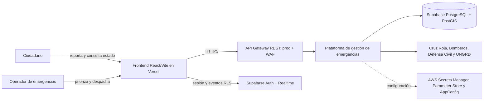
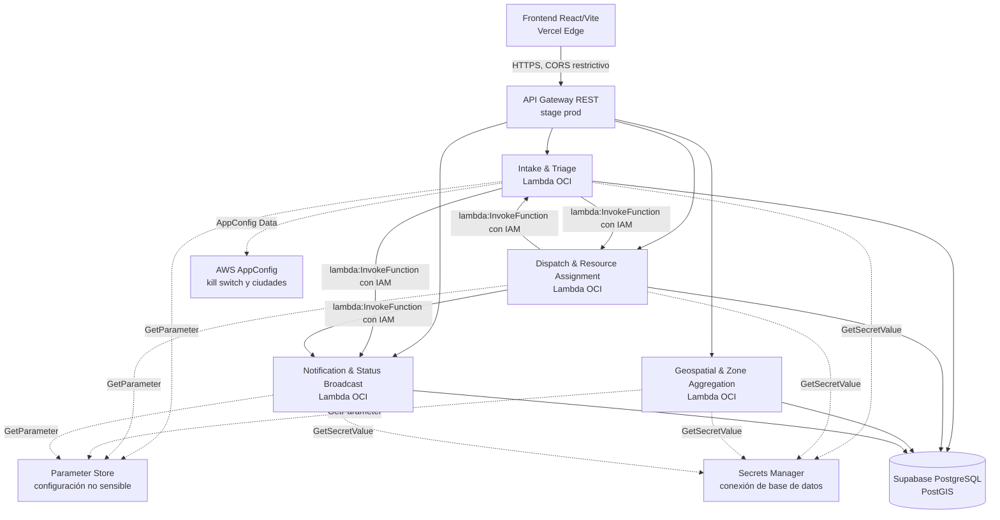
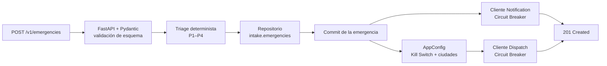
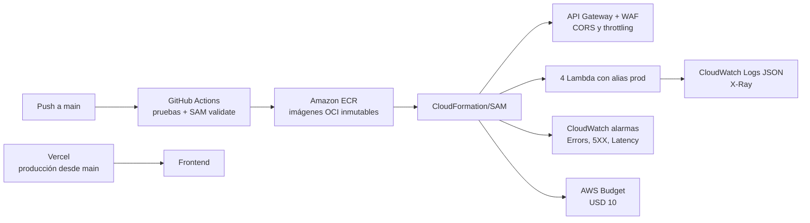

# Arquitectura C4

Este documento es el anexo de diagramas del informe técnico. Describe la
arquitectura objetivo de producción; el detalle operativo y la estrategia de
despliegue están en [despliegue-produccion.md](despliegue-produccion.md).

## Alcance y leyenda

- Las flechas continuas representan tráfico o invocaciones en tiempo de
  ejecución; las punteadas, lectura de configuración.
- **Ciudadano** y **operador** son los dos perfiles de usuario. Las cuatro
  ciudades atendidas son Chocó/Quibdó, Pereira, Cali y Manizales.
- Cada microservicio es propietario de su esquema lógico. La única lectura
  cruzada permitida es `geo` sobre `intake.emergencies`, mediante `geo_reader`
  de solo lectura; la decisión se justifica en
  [decisiones.md](decisiones.md#1-lectura-cruzada-de-geospatial-sobre-intakeemergencies).

## Nivel 1 — Contexto

La plataforma recibe solicitudes de rescate/médicas, albergue, suministros y
daño estructural. El triage produce prioridades P1 a P4 y el centro de despacho
coordina los recursos por ciudad. Supabase Auth y Realtime son servicios externos
de apoyo: el navegador usa una clave anónima pública y las políticas RLS siguen
siendo el límite de autorización.

## Nivel 2 — Contenedores

| Contenedor | Responsabilidad | Datos propietarios | Interfaces públicas |
|---|---|---|---|
| Frontend | Formularios ciudadanos, seguimiento, mapa y tablero de operador | Estado de UI | Vercel; Supabase Auth/Realtime; API Gateway |
| Intake | Validación, persistencia y triage determinista | `intake.emergencies` | `POST/GET/PATCH /v1/emergencies` |
| Dispatch | Búsqueda y asignación transaccional de unidades | `dispatch.resources`, `dispatch.assignments` | `/v1/dispatches`, `/v1/resources` |
| Geospatial | Emergencias por ciudad y hotspots PostGIS | `geo.hotspots` | `/v1/zones/{city}/…` |
| Notification | Registro y difusión de cambios de estado | `notification.notifications` | `/v1/notifications` |

El frontend no llama directamente a las Lambdas ni a la base de datos para la
lógica operativa. Las rutas y contratos completos se documentan en el
[README](../README.md#endpoints).

## Nivel 3 — Componente crítico: Intake & Triage

La persistencia ocurre antes de Notification y Dispatch. En consecuencia, una
dependencia secundaria caída, un circuito abierto o el kill switch no elimina ni
rechaza el reporte: la emergencia queda disponible para asignación manual.

## Vista de despliegue y controles transversales

- API Gateway aplica stage formal `prod`, CORS limitado al origen de Vercel y
  throttling. WAF añade límite por IP.
- Cada Lambda recibe permisos IAM mínimos únicamente para su parámetro, secreto
  y las invocaciones internas que necesita.
- CloudWatch monitorea errores de Intake, errores 5xx del gateway y latencia
  superior a 1500 ms. AWS Budgets alerta al 50 % real y 85 % proyectado del
  límite mensual.
- La estrategia elegida es **Feature Flags + Circuit Breakers**; el detalle y el
  flujo de rollback de configuración están en
  [despliegue-produccion.md](despliegue-produccion.md#3-flags-operativas).

## Estado documentado del requisito PWA

El frontend actual es React/Vite desplegable en Vercel y ofrece actualización
reactiva mediante Supabase Realtime. A la fecha del repositorio **no contiene
manifest, service worker ni cola de reportes offline**. Por tanto, esta
arquitectura no debe presentarse como PWA/offline-first hasta implementar esos
artefactos. Es una brecha funcional, no una brecha que pueda corregirse solo con
documentación; queda trazada en el [informe técnico](informe-tecnico.md#9-límites-y-pendientes-no-documentales).
