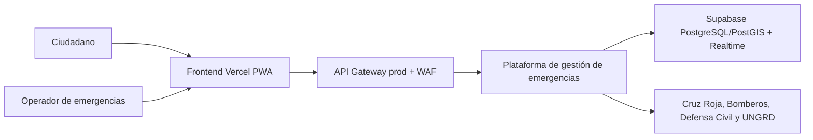
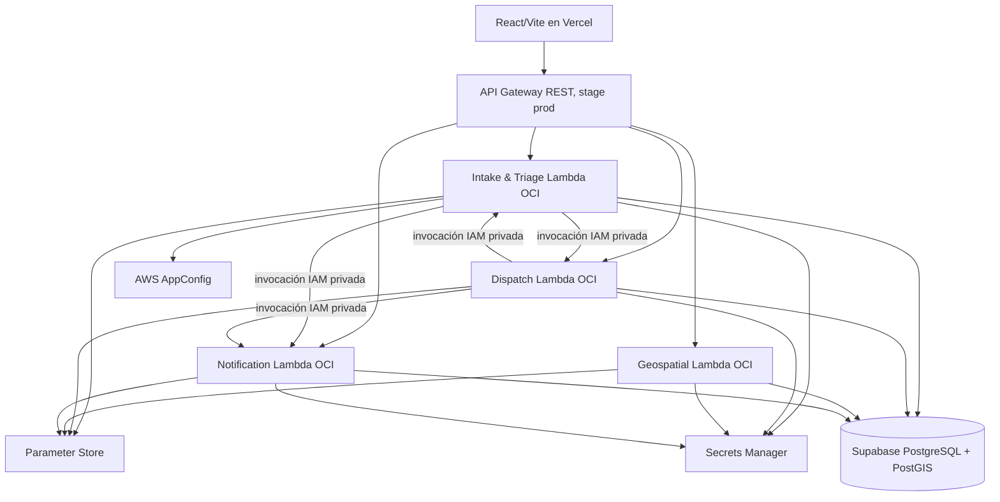
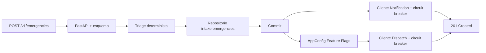

# Arquitectura C4

## Contexto

## Contenedores

## Componente crítico: Intake

El commit precede las dependencias secundarias. Así, un Kill Switch, un circuito
abierto o una caída de Dispatch/Notification no elimina ni rechaza una solicitud
de auxilio.
