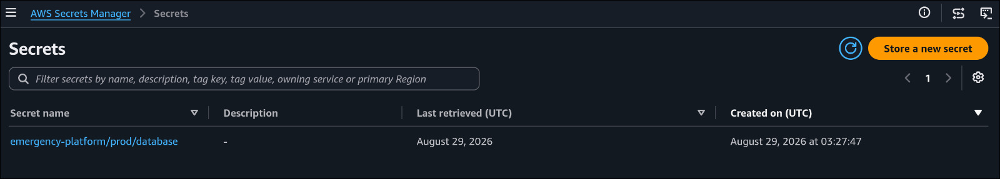
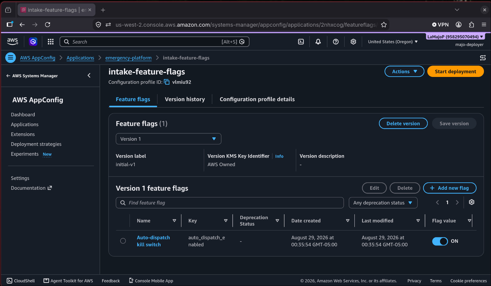
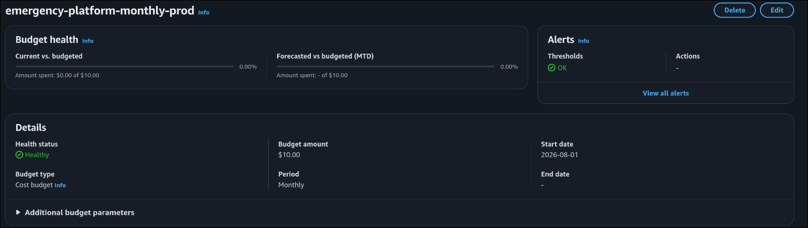
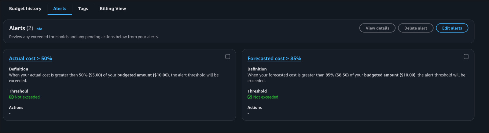

# Evidencias de entrega — Parcial 1

Las capturas incorporadas corresponden a la configuración de producción en AWS.

## Secretos

Se registra el secreto `emergency-platform/prod/database` sin exponer su valor.

## Configuración dinámica

AppConfig muestra la versión inicial del kill switch de auto-despacho.

## Presupuesto de AWS

El presupuesto mensual es de USD 10 e incluye las alertas configuradas al 50 % y al 85 %.

## Video demostrativo

**Enlace:** [Video demostrativo](https://drive.google.com/file/d/1RaviFx44iPRvq5BYfRTXewkFTCw4Lzsg/view?usp=drivesdk)
