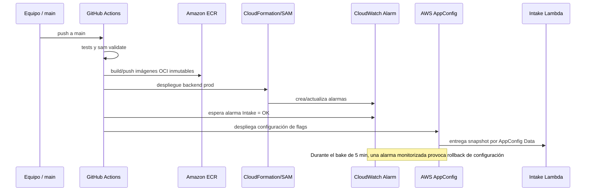

# Informe técnico arquitectónico — Parcial 1

## Ficha del proyecto

| Campo | Valor |
|---|---|
| Curso | Patrones Arquitectónicos Avanzados |
| Proyecto | Plataforma serverless resiliente para gestión de emergencias |
| API Gateway, stage `prod` | `https://0mdz1txwdc.execute-api.us-west-2.amazonaws.com/prod` |
| Estrategia progresiva | Opción B: AWS AppConfig Feature Flags + Circuit Breakers |

Este informe reúne la documentación técnica del proyecto. Las capturas de
configuración se presentan en [evidencias-entrega.md](evidencias-entrega.md).

## 1. Problema y objetivo

Un evento sísmico en la zona centro-occidental y pacífica de Colombia puede
producir tráfico concurrente, reportes duplicados y datos geográficos difíciles
de procesar. La plataforma recibe solicitudes de auxilio, calcula un triage
determinista, muestra la situación a los organismos de respuesta y asigna
recursos según disponibilidad y proximidad.

El alcance cubre Chocó/Quibdó, Pereira, Cali y Manizales, y está compuesto por
microservicios contenerizados desplegables en AWS Lambda, una capa HTTP central
con API Gateway, persistencia Supabase/PostgreSQL/PostGIS, frontend Vercel y
controles operativos para proteger el servicio y el presupuesto.

## 2. Cobertura del dominio

| Solicitud | Prioridad base | Información crítica en el payload | Resultado del flujo |
|---|---|---|---|
| Búsqueda y rescate urbano / emergencia médica (`RESCUE`) | P1 | Coordenadas, heridos, atrapados, fuego y fuga de gas | Intake conserva P1 si hay riesgo; sin factores críticos baja a P2. |
| Albergue y refugio (`SHELTER`) | P2 | Adultos, niños, adultos mayores, accesibilidad y habitabilidad | Sube a P1 ante población vulnerable o vivienda inhabitable con alta afectación. |
| Suministros (`SUPPLIES`) | P3 | Categorías de insumo y personas afectadas | Sube a P2 ante agua potable o 20+ personas. |
| Daño estructural (`STRUCTURAL_DAMAGE`) | P4 | Tipo de edificación, fisuras y riesgo de colapso | Sube a P2 si existe riesgo de colapso. |

Las reglas completas, contratos y casos de prueba están en
[emergency-platform-spec.md](../emergency-platform-spec.md#4-reglas-de-triage-intake).
Las cuatro ciudades son un enum validado por Intake y se usan además para
filtrar recursos, zonas y despliegue selectivo de flags.

## 3. Arquitectura y responsabilidades

Los diagramas C4 de contexto, contenedores, componentes y despliegue están en
[arquitectura-c4.md](arquitectura-c4.md). La separación de responsabilidades es:

| Servicio | Entrada principal | Responsabilidad | Patrón de resiliencia |
|---|---|---|---|
| Intake & Triage | `POST /v1/emergencies` | Valida, calcula la severidad, persiste el reporte e inicia acciones secundarias. | Persistir primero; circuit breakers para Dispatch y Notification; flags de AppConfig. |
| Dispatch & Resource Assignment | `POST/PATCH /v1/dispatches` | Localiza unidades, evita asignaciones duplicadas y avanza el estado operativo. | Bloqueo transaccional de recurso y asignación manual como recuperación. |
| Geospatial & Zone Aggregation | `GET /v1/zones/{city}/…` | Consulta emergencias por ciudad y calcula hotspots con PostGIS. | Índices geoespaciales y lectura cruzada limitada a solo lectura. |
| Notification & Status Broadcast | `POST/GET /v1/notifications` | Registra cambios de estado y los difunde. | Comunicación secundaria: un fallo no rechaza el reporte de emergencia. |

Los Dockerfiles de `services/*/Dockerfile` usan etapas separadas `local` y
`lambda`. El pipeline construye el target `lambda` para arquitectura
`linux/amd64`, lo publica en ECR y la plantilla SAM lo ejecuta con
`PackageType: Image`.

## 4. Datos, geografía y tiempo real

Cada servicio es dueño de un esquema: `intake`, `dispatch`, `geo` y
`notification`. Las migraciones reproducibles están en `database/migrations/`;
habilitan PostGIS, tipos de dominio, índices GIST, triggers y grants. Las
políticas de `database/rls/` separan ciudadano y operador:

- Ciudadano: solo crea y consulta sus propios reportes; no ve recursos ni
  emergencias de otras personas.
- Operador: consulta y actualiza la información necesaria para coordinar la
  respuesta.
- No hay permisos `DELETE` para los roles de aplicación: una emergencia se
  marca como `CANCELLED` y conserva su trazabilidad.

El frontend se autentica con Supabase Auth y se suscribe a Realtime sobre
`intake.emergencies` y `notification.notifications`. Cada evento invalida la
consulta REST pertinente, por lo que la pantalla obtiene nuevamente la forma
normalizada de la API sin copiar directamente filas del WAL. RLS se mantiene en
las suscripciones. La explicación de amenazas y controles está en
[seguridad.md](seguridad.md).

## 5. Seguridad y gestión de secretos

| Activo | Mecanismo | Evidencia documental |
|---|---|---|
| API pública | API Gateway `prod`, CORS restrictivo, throttling del stage y WAF por IP | `infrastructure/template.yaml`; [registro de producción](registro-configuracion-produccion.md) |
| Configuración no sensible | Parameter Store por servicio, leída durante cold start | `services/*/app/config.py` |
| Credencial de base de datos | Secrets Manager, leída durante cold start | `services/*/app/secrets.py` |
| Acceso entre Lambdas | Roles IAM mínimos con `lambda:InvokeFunction` solo a destinos permitidos | `infrastructure/template.yaml` |
| Datos de usuarios | Supabase RLS y roles en `app_metadata` | [seguridad.md](seguridad.md) y `database/rls/` |
| Repositorio | `.gitignore`, revisión de historial y prohibición de `.env` | [README](../README.md) y `.gitignore` |

No se registran valores secretos en el informe, capturas ni logs. Las variables
`VITE_*` de Vercel se limitan a URL del API, URL de Supabase y clave anónima; la
Service Role Key no puede llegar al navegador.

## 6. Despliegue continuo y estrategia elegida

La solución adopta la opción B del parcial: **Feature Flags y Circuit Breakers**.
No se declara un canary de Lambda para no atribuir al sistema una estrategia que
no usa. El alias `prod` se conserva para las invocaciones privadas de Lambda,
pero la liberación gradual de capacidades se hace en AppConfig.

La flag `auto_dispatch_enabled` funciona como kill switch global. Su atributo
`enabled_cities` permite activar el auto-despacho inicialmente solo en Pereira y
Manizales. El circuito por dependencia abre luego de tres errores/timeout,
espera 60 segundos y permite una sonda de recuperación. La persistencia se hace
antes de ambas llamadas; por ello no se pierde un reporte cuando Dispatch o
Notification fallan.

El procedimiento operativo, los permisos de GitHub OIDC y el flujo de prueba se
encuentran en [despliegue-produccion.md](despliegue-produccion.md).

## 7. Observabilidad y gobernanza de costos

Los cuatro servicios emiten logs JSON a CloudWatch y la plantilla activa X-Ray.
Las alarmas de producción declaradas son:

| Alarma | Condición | Uso operativo |
|---|---|---|
| `emergency-intake-errors-prod` | 1+ error de Intake en 60 s | Monitor de AppConfig y alerta de degradación de la ruta crítica. |
| `emergency-api-5xx-prod` | 1+ respuesta 5xx de API Gateway en 60 s | Detectar indisponibilidad pública. |
| `emergency-api-latency-prod` | Latencia media mayor de 1500 ms | Detectar saturación o dependencia lenta. |

El presupuesto `emergency-platform-monthly-prod` tiene límite de USD 10,
notificación de gasto real al 50 % y previsión al 85 %. La configuración y sus
capturas se describen en
[registro-configuracion-produccion.md](registro-configuracion-produccion.md) y
[evidencias-entrega.md](evidencias-entrega.md).

## 8. Trazabilidad de los entregables

| Entregable | Documento / fuente en el repo |
|---|---|
| Repositorios sin secretos | README, `.gitignore`, [seguridad](seguridad.md) |
| Frontend Vercel y API `prod` | [registro de producción](registro-configuracion-produccion.md) |
| Informe y diagramas C4 | Este informe y [arquitectura-c4.md](arquitectura-c4.md) |
| Secretos dinámicos e IAM | [seguridad.md](seguridad.md), plantilla SAM y [evidencias](evidencias-entrega.md#secretos) |
| Feature Flags / Kill Switch | [despliegue-produccion.md](despliegue-produccion.md) y [evidencias](evidencias-entrega.md#configuración-dinámica) |
| RLS, PostGIS y Realtime | [seguridad.md](seguridad.md), scripts `database/rls/` |
| Budget y alertas | [registro de producción](registro-configuracion-produccion.md) y [evidencias](evidencias-entrega.md#presupuesto-de-aws) |
| Video demostrativo | [Evidencias de entrega](evidencias-entrega.md#video-demostrativo) |
